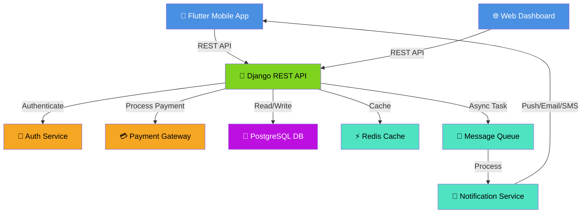
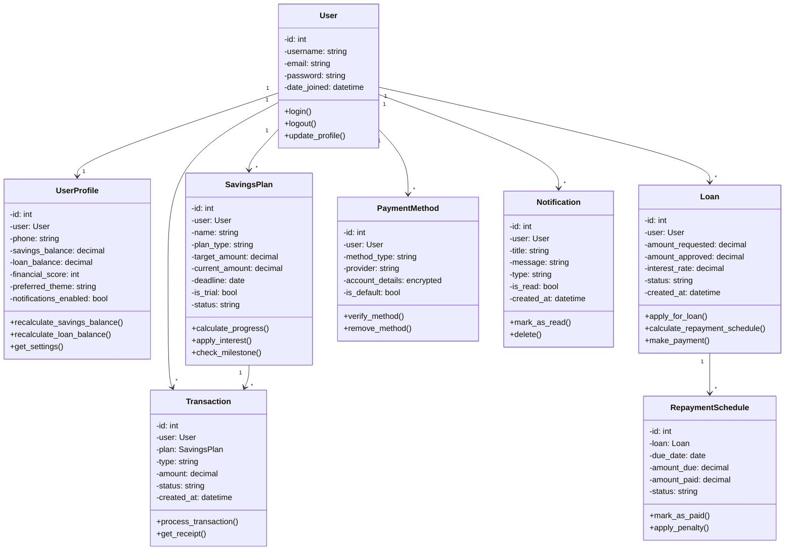
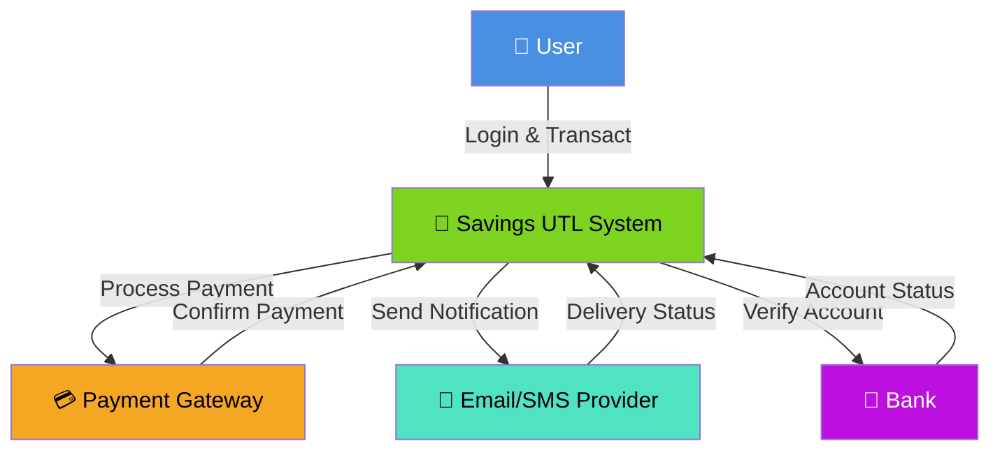
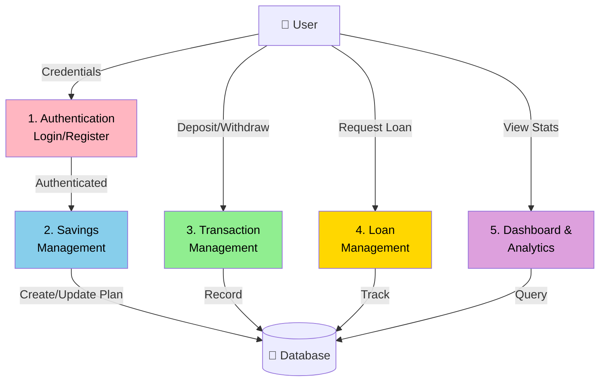
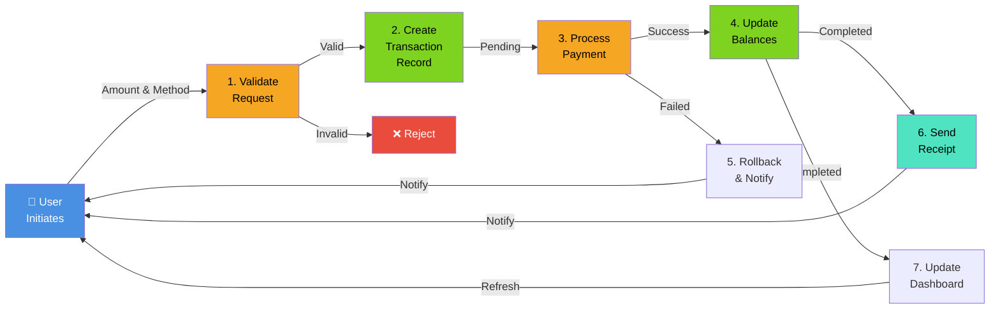
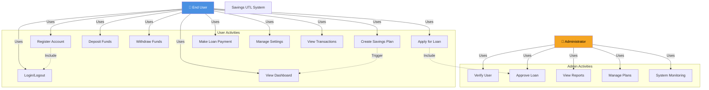
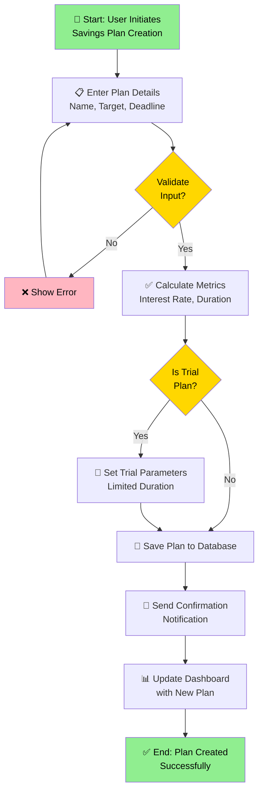
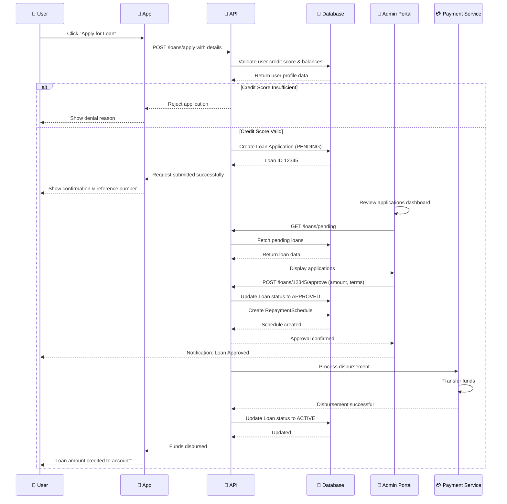
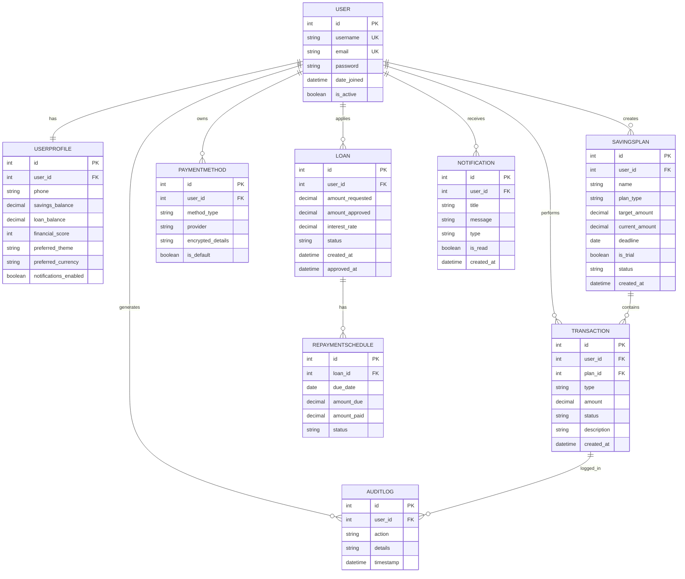

# Savings UTL - Comprehensive Project Documentation

**Project:** Futuristic Microfinance Savings & Loan Platform  
**Version:** 1.0.0  
**Date:** April 15, 2026

---

## 1. MODULE DESCRIPTION

### Module 1: User Authentication & Profile Management
**Description:** Handles user registration, login, password management, and profile maintenance.

**Key Features:**
- User registration with email/phone verification
- Login with 2FA support
- Biometric authentication (fingerprint/face recognition)
- Profile management (personal info, preferences, settings)
- Password reset and account recovery
- User session management and token-based authentication

**Technologies:** Django REST API (Backend), Flutter (Frontend)

**Database Entities:** User, UserProfile, AuthToken, AuditLog

---

### Module 2: Savings Plan Management
**Description:** Core module for creating, managing, and tracking savings plans with various configurations.

**Key Features:**
- Create flexible savings plans (daily, weekly, monthly, custom)
- Set savings goals with target amounts and deadlines
- Automatic interest calculation based on plan type
- Plan pause/resume functionality
- Trial plan support for new users
- Progress tracking and milestone achievements
- Plan analytics and performance metrics

**Technologies:** Django ORM (Backend), SQLite (Database), Provider (State Management)

**Database Entities:** SavingsPlan, PlanType, Milestone, PlanMetrics

---

### Module 3: Transactions & Financial Operations
**Description:** Manages all financial transactions including deposits, withdrawals, interest rewards, and penalties.

**Key Features:**
- Deposit transactions with multiple payment methods
- Withdrawal requests with approval workflow
- Interest reward calculations (daily/weekly/monthly accrual)
- Penalty application for plan violations
- Transaction history and receipts
- Real-time transaction status tracking
- Reconciliation with payment gateways

**Technologies:** Django REST API, Celery (async tasks), PostgreSQL

**Database Entities:** Transaction, PaymentMethod, Receipt, TransactionLog

---

### Module 4: Loan & Credit Management
**Description:** Handles loan applications, approvals, disbursement, and repayment tracking.

**Key Features:**
- Loan application with eligibility criteria
- Credit scoring based on savings history
- Loan approval workflow with admin review
- Disbursement scheduling
- Repayment schedule generation
- Interest calculation for loans
- Late payment penalties and reminders
- Loan status tracking (pending, approved, active, completed, defaulted)

**Technologies:** Django Models, Business Logic Engine

**Database Entities:** Loan, LoanApplication, RepaymentSchedule, CreditScore

---

### Module 5: Dashboard & Analytics
**Description:** Provides comprehensive data visualization and insights for users and administrators.

**Key Features:**
- User dashboard with key metrics (balance, savings progress, loan status)
- Charts and graphs (fl_chart library)
- Financial reports and statements
- Goal progress visualization
- Transaction analytics
- Admin dashboard with system statistics
- Trend analysis and forecasting

**Technologies:** Flutter (UI), Chart Libraries, Data Aggregation API

**Database Entities:** Dashboard metrics via aggregated queries

---

### Module 6: Notifications & Alerts
**Description:** Real-time notification system for transaction alerts, reminders, and important updates.

**Key Features:**
- Transaction notifications (deposit, withdrawal, transfer)
- Savings milestone notifications
- Loan payment reminders
- System alerts and announcements
- Notification preferences management
- Push notifications and in-app notifications
- Email and SMS notifications
- Notification history

**Technologies:** Django Signals, Firebase Cloud Messaging, Twilio

**Database Entities:** Notification, NotificationPreference, NotificationLog

---

### Module 7: Settings & Preferences
**Description:** User configuration system for personalization and security settings.

**Key Features:**
- Theme preferences (light/dark mode)
- Language selection (i18n support)
- Currency preferences
- Notification settings
- Security settings (2FA, biometric)
- Payment method management
- Auto-save configuration
- Data export options

**Technologies:** Flutter SharedPreferences, Django Settings API

**Database Entities:** UserPreference, SecuritySettings

---

### Module 8: Reporting & Compliance
**Description:** System-wide reporting for auditing, compliance, and regulatory requirements.

**Key Features:**
- Transaction audit logs
- User activity logs
- Financial reports (monthly, quarterly, annual)
- Compliance reports
- System health monitoring
- Data backup and archival
- GDPR compliance features

**Technologies:** Django Admin, Reporting Engine

**Database Entities:** AuditLog, ComplianceReport, SystemLog

---

## 2. UML DIAGRAMS

### 2.1 System Architecture Diagram

---

### 2.2 Class Diagram

---

### 2.3 Data Flow Diagrams

#### 2.3.1 Level 0 - Context Diagram (System Overview)

#### 2.3.2 Level 1 - Main Processes

#### 2.3.3 Level 2 - Detailed Deposit Transaction Flow

---

### 2.4 Use Case Diagram

---

### 2.5 Activity Diagram - Savings Plan Creation

---

### 2.6 Sequential Diagram - Loan Application to Disbursement

---

### 2.7 Entity Relationship Diagram (ERD)

---

## 3. IMPLEMENTATION PLANNING

### Phase 1: Foundation (Months 1-3)

**Objective:** Build core user management and savings infrastructure

#### Phase 1 Modules:
1. **User Authentication & Profile Management**
   - User registration and login
   - JWT token management
   - User profile creation and updates
   - Basic password management
   - **Deliverables:**
     - REST API endpoints for auth
     - Flutter login/signup screens
     - User profile management screen
     - Database schema and migrations

2. **User Settings & Preferences**
   - Theme selection (light/dark)
   - Language preferences (i18n)
   - Currency selection
   - Notification preferences
   - **Deliverables:**
     - Settings API endpoints
     - Settings UI screens
     - SharedPreferences integration
     - User preference persistence

#### Phase 1 Timeline:
- **Week 1-2:** Backend setup, authentication API, database schema
- **Week 3-4:** Frontend login/signup screens, authentication integration
- **Week 5-6:** User profile management, CRUD operations
- **Week 7-8:** Settings module, preferences management
- **Week 9-10:** Testing, bug fixes, documentation
- **Week 11-12:** Deployment to staging, UAT preparation

#### Phase 1 Deliverables:
- ✅ Authentication API (Login, Register, Refresh Token, Logout)
- ✅ User Profile API (Get, Update, Delete)
- ✅ Settings API (Get, Update Preferences)
- ✅ Flutter UI for Auth and Settings
- ✅ Database migrations
- ✅ API documentation (Swagger)
- ✅ Unit tests (80%+ coverage)

---

### Phase 2: Transactions & Savings (Months 4-6)

**Objective:** Implement core savings and transaction functionality

#### Phase 2 Modules:
1. **Savings Plan Management**
   - Create/update/delete savings plans
   - Multiple plan types (daily, weekly, monthly, custom)
   - Trial plans for new users
   - Plan status management
   - Interest calculation engine
   - Milestone tracking
   - **Deliverables:**
     - Savings plan CRUD API
     - Plan type configuration
     - Interest calculation logic
     - Plan dashboard UI
     - Milestone achievement system

2. **Transactions & Financial Operations**
   - Deposit transactions
   - Withdrawal requests
   - Interest reward application
   - Penalty system
   - Transaction history and filtering
   - Receipt generation
   - **Deliverables:**
     - Transaction API (Create, List, Get)
     - Payment method management API
     - Transaction UI screens
     - Receipt generation service
     - Transaction status tracking

3. **Dashboard & Analytics**
   - User dashboard with key metrics
   - Balance overview
   - Savings progress charts
   - Transaction history
   - Financial goals visualization
   - **Deliverables:**
     - Dashboard API (aggregated stats)
     - Flutter dashboard UI
     - Chart integration (fl_chart)
     - Real-time balance updates

4. **Notifications & Alerts**
   - Transaction notifications
   - Savings milestone alerts
   - System alerts
   - Notification preferences
   - Push notification integration
   - **Deliverables:**
     - Notification API
     - Firebase Cloud Messaging setup
     - In-app notification UI
     - Notification preference settings

#### Phase 2 Timeline:
- **Week 1-2:** Savings plan API and database schema
- **Week 3-4:** Transaction management system
- **Week 5-6:** Frontend UI for savings and transactions
- **Week 7-8:** Dashboard and analytics integration
- **Week 9-10:** Notifications system setup
- **Week 11-12:** Integration testing, performance optimization
- **Week 13-14:** Final QA, documentation, deployment preparation

#### Phase 2 Deliverables:
- ✅ Savings Plan Management API
- ✅ Transaction Management API
- ✅ Payment Method Management API
- ✅ Dashboard API with aggregated statistics
- ✅ Notification System (Push, In-app, Email, SMS)
- ✅ Flutter UI for savings, transactions, dashboard
- ✅ Charts and visualizations
- ✅ Integration tests (70%+ coverage)
- ✅ API documentation updates
- ✅ Performance optimization report

---

### Phase 3: Loans & Advanced Features (Months 7-9) - Future

**Objective:** Add loan management and advanced analytics features

#### Phase 3 Modules (Planned):
1. Loan & Credit Management
2. Reporting & Compliance
3. Advanced Analytics & Forecasting
4. Admin Dashboard & Monitoring

---

## Summary

### Technology Stack
- **Frontend:** Flutter (Dart)
- **Backend:** Django REST Framework (Python)
- **Database:** PostgreSQL (Production), SQLite (Development)
- **Cache:** Redis
- **Task Queue:** Celery
- **Real-time:** WebSockets (optional)
- **Notifications:** Firebase Cloud Messaging, Twilio
- **Deployment:** Docker, Nginx, Gunicorn

### Success Criteria for Phase 1
- [ ] All authentication flows working (Register, Login, 2FA)
- [ ] User profiles fully functional
- [ ] Settings persist correctly
- [ ] 80%+ API endpoint test coverage
- [ ] Zero critical security issues
- [ ] UI/UX meets design standards

### Success Criteria for Phase 2
- [ ] All transactions processing correctly
- [ ] Interest calculations accurate
- [ ] Dashboard performance < 500ms
- [ ] Notifications delivered reliably
- [ ] 70%+ integration test coverage
- [ ] System scales to 10,000 concurrent users
- [ ] Zero financial data loss
- [ ] GDPR compliance verified

---

**Document Version:** 1.0  
**Last Updated:** April 15, 2026  
**Next Review:** Monthly
