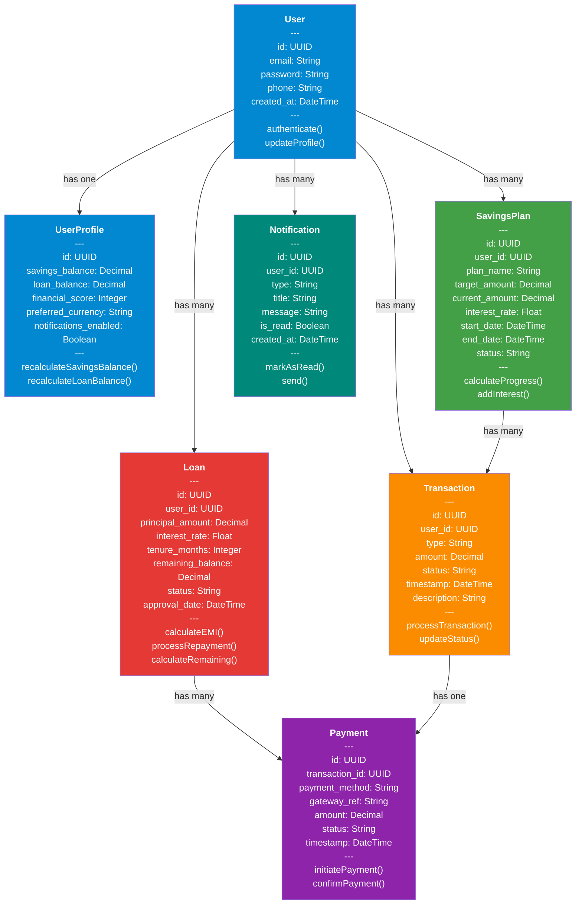
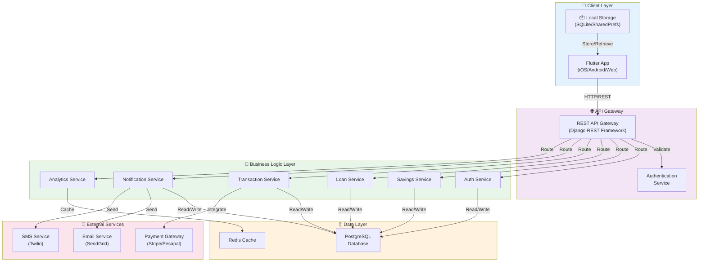
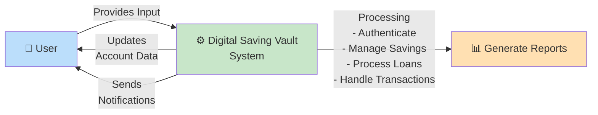
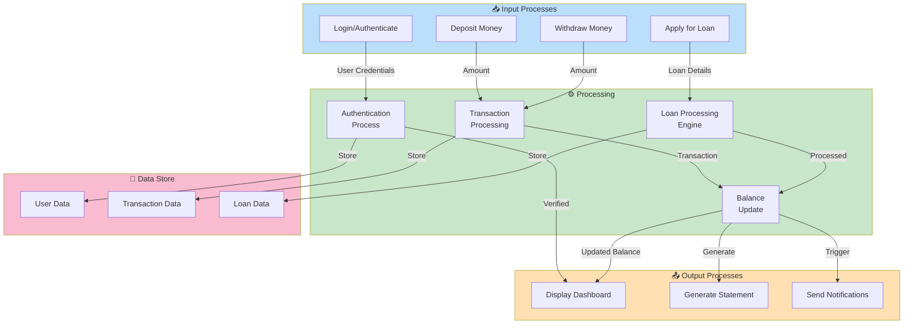
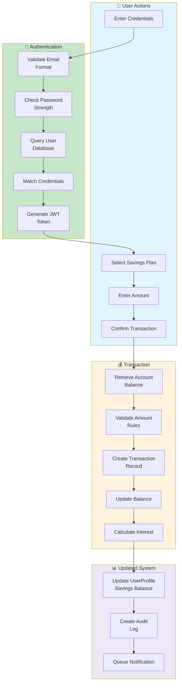
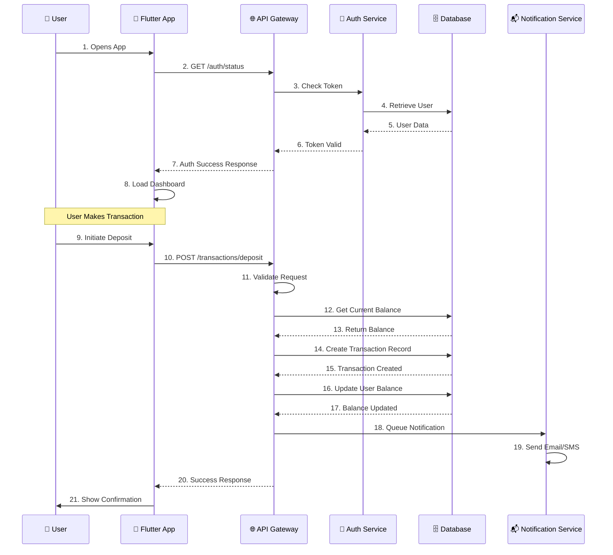
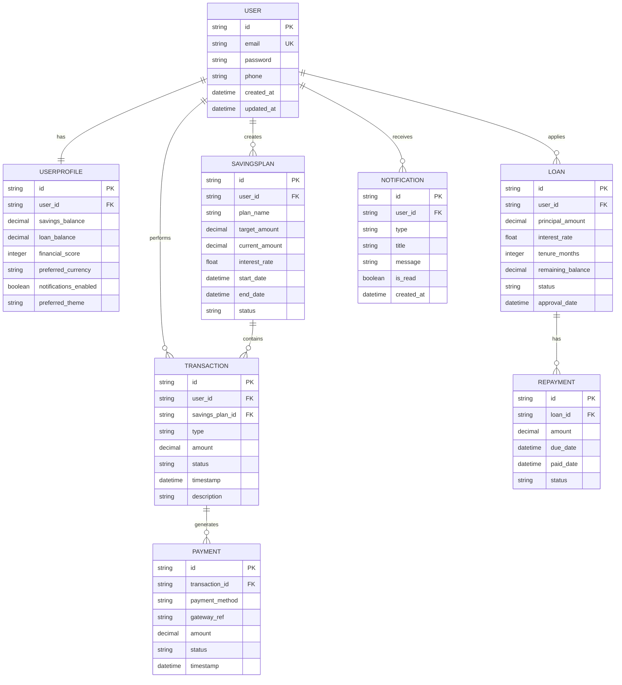

# Digital Saving Vault (Nzelu Digital Saving)
## Comprehensive Project Documentation

---

## 1. MODULE DESCRIPTIONS

### Module 1: Authentication & User Management
- **Purpose**: Handle user registration, login, password reset, and profile management
- **Key Features**: User authentication, profile settings, 2FA, biometric login, user data persistence
- **Technologies**: Flutter (frontend), Django (backend), JWT tokens, secure credential storage
- **Actors**: Users, System Administrator

### Module 2: Savings Management
- **Purpose**: Allow users to create, manage, and track savings plans and deposits
- **Key Features**: Create savings plans, deposit tracking, interest calculation, auto-save feature, withdrawal processing
- **Technologies**: Provider state management, REST API, SQLite (local cache)
- **Actors**: Users, Account Holders

### Module 3: Credit/Loan Management
- **Purpose**: Enable users to access microfinance credit with flexible repayment options
- **Key Features**: Loan application, approval workflow, EMI calculation, repayment tracking, interest calculation
- **Technologies**: Business logic engine, Payment gateway integration, Notification service
- **Actors**: Borrowers, Credit Officers, Admin

### Module 4: Dashboard & Analytics
- **Purpose**: Provide comprehensive financial overview and transaction history
- **Key Features**: Balance display, transaction history, savings progress charts, financial score display, reports
- **Technologies**: FL Charts, Data aggregation service, Analytics engine
- **Actors**: Users, Finance Managers

### Module 5: Payment & Transaction Processing
- **Purpose**: Handle all financial transactions (deposits, withdrawals, repayments)
- **Key Features**: Transaction verification, payment gateway integration, receipt generation, transaction history
- **Technologies**: Payment APIs, Django models, PostgreSQL/SQLite, Transaction logger
- **Actors**: Users, Payment Processors

### Module 6: Notifications & Alerts
- **Purpose**: Keep users informed about account activities and important alerts
- **Key Features**: Email/SMS notifications, transaction alerts, milestone celebrations, app notifications
- **Technologies**: Push notification service, Email services, Message queues
- **Actors**: Users, System

### Module 7: Settings & Preferences
- **Purpose**: Allow users to customize their app experience and security settings
- **Key Features**: Theme selection, language preferences, currency settings, notification preferences, security settings
- **Technologies**: Shared Preferences (Flutter), Backend cache
- **Actors**: End Users

---

## 2. UML DIAGRAMS

### 2.1 Use Case Diagram

```mermaid
graph TB
    User["👤 End User"]
    Admin["👨‍💼 Administrator"]
    System["⚙️ System"]
    
    User -->|UC1| Register["Register Account"]
    User -->|UC2| Login["Login/Authentication"]
    User -->|UC3| CreateSavingsPlan["Create Savings Plan"]
    User -->|UC4| DepositAmount["Deposit Money"]
    User -->|UC5| ViewBalance["View Account Balance"]
    User -->|UC6| WithdrawAmount["Withdraw Money"]
    User -->|UC7| ApplyForCredit["Apply for Credit"]
    User -->|UC8| ViewTransactionHistory["View Transactions"]
    User -->|UC9| ManageSettings["Manage Settings"]
    
    Admin -->|UC10| ApproveCredit["Approve/Reject Credit"]
    Admin -->|UC11| GenerateReports["Generate Reports"]
    Admin -->|UC12| ManageUsers["Manage Users"]
    
    System -->|UC13| CalculateInterest["Calculate Interest"]
    System -->|UC14| SendNotifications["Send Notifications"]
    System -->|UC15| UpdateBalances["Update Balances"]

    style Register fill:#e1f5ff
    style Login fill:#e1f5ff
    style CreateSavingsPlan fill:#c8e6c9
    style DepositAmount fill:#c8e6c9
    style ViewBalance fill:#e0e0e0
    style WithdrawAmount fill:#ffccbc
    style ApplyForCredit fill:#f8bbd0
    style ViewTransactionHistory fill:#e0e0e0
    style ManageSettings fill:#ede7f6
    style ApproveCredit fill:#ffe0b2
    style GenerateReports fill:#ffe0b2
    style ManageUsers fill:#ffe0b2
    style CalculateInterest fill:#f0f4c3
    style SendNotifications fill:#f0f4c3
    style UpdateBalances fill:#f0f4c3
```


### 2.2 Class Diagram


### 2.3 System Architecture Diagram


### 2.4 Data Flow Diagram - Level 1


### 2.5 Data Flow Diagram - Level 2


### 2.6 Data Flow Diagram - Level 3


### 2.7 Activity Diagram
```mermaid
stateDiagram-v2
    [*] --> OpenApp: User Opens App
    OpenApp --> CheckLogin: Check Authentication<br/>Status
    CheckLogin --> IsLoggedIn{Is User<br/>Logged In?}
    
    IsLoggedIn -->|No| LoginScreen: Navigate to<br/>Login Screen
    IsLoggedIn -->|Yes| Dashboard: Show Dashboard
    
    LoginScreen --> InvalidCreds{Credentials<br/>Valid?}
    InvalidCreds -->|No| ErrorMsg: Show Error
    ErrorMsg --> LoginScreen
    InvalidCreds -->|Yes| Dashboard
    
    Dashboard --> UserAction{User<br/>Action}
    
    UserAction -->|View Balance| ViewBalance: Retrieve & Display<br/>Account Balance
    UserAction -->|Make Deposit| MakeDeposit: Navigate to<br/>Deposit Screen
    UserAction -->|Make Withdrawal| MakeWithdraw: Navigate to<br/>Withdrawal Screen
    UserAction -->|View Transactions| ViewTrans: Show Transaction<br/>History
    UserAction -->|Apply for Loan| ApplyLoan: Navigate to<br/>Loan Application
    UserAction -->|View Settings| Settings: Show User<br/>Settings
    UserAction -->|Logout| Logout: Clear Session
    
    ViewBalance --> ProcessData{Data<br/>Fetch<br/>Success?}
    MakeDeposit --> EnterAmount: Enter Amount<br/>& Plan
    MakeWithdraw --> EnterAmount
    ApplyLoan --> EnterLoanDetails: Fill Loan<br/>Application
    
    ProcessData -->|Yes| Dashboard
    ProcessData -->|No| ErrorMsg
    
    EnterAmount --> Confirm{Confirm<br/>Transaction?}
    EnterLoanDetails --> Confirm
    
    Confirm -->|No| Dashboard
    Confirm -->|Yes| ProcessTrans: Process<br/>Transaction
    
    ProcessTrans --> TransSuccess{Transaction<br/>Success?}
    TransSuccess -->|Yes| Success: Show Success<br/>Message
    TransSuccess -->|No| ErrorMsg
    
    Success --> SendNotif: Send Notification
    SendNotif --> Dashboard
    
    Settings --> UpdateSettings{Update<br/>Settings?}
    UpdateSettings -->|Yes| SaveSettings: Save Changes
    UpdateSettings -->|No| Dashboard
    SaveSettings --> Dashboard
    
    Logout --> [*]
```

### 2.8 Sequential Diagram


### 2.9 Entity Relationship Diagram


---

## 3. PHASE 1 & PHASE 2 PLANNING

### Phase 1: Core Foundation (Months 1-2)
**Objective**: Build essential features for MVP

#### Phase 1 Modules:
1. **Authentication & User Management Module**
   - User registration with email verification
   - Login/Logout functionality
   - Password reset feature
   - Basic profile management
   - Secure token storage

2. **Savings Management Module (Basic)**
   - Create savings plans
   - View savings balance
   - Basic deposit tracking
   - Manual deposit processing
   - Simple interest calculation

3. **Dashboard & Analytics Module (Basic)**
   - Display current balance
   - Show recent transactions (last 10)
   - Basic statistics and progress bars
   - Simple transaction history

4. **Payment & Transaction Processing Module (Basic)**
   - Deposit transaction creation
   - Basic withdrawal requests
   - Transaction status tracking
   - Receipt generation

5. **Settings & Preferences Module**
   - Theme selection (Light/Dark)
   - Language preferences (English/Local)
   - Currency selection
   - Notification toggle
   - Security settings

**Phase 1 Deliverables:**
- ✅ Functional Flutter app (Android/iOS)
- ✅ Django backend API endpoints
- ✅ User authentication system
- ✅ Basic savings functionality
- ✅ Transaction processing
- ✅ Simple dashboard
- ✅ MVP ready for testing

---

### Phase 2: Advanced Features (Months 3-4)
**Objective**: Add credit/loan system and advanced features

#### Phase 2 Modules:
1. **Credit/Loan Management Module (Full)**
   - Loan application submission
   - Automated approval workflow
   - EMI calculation engine
   - Repayment schedule generation
   - Partial payment processing
   - Loan status tracking

2. **Notifications & Alerts Module (Full)**
   - Email notifications
   - SMS notifications
   - Push notifications
   - Transaction alerts
   - Milestone celebrations
   - Account alerts

3. **Dashboard & Analytics Module (Advanced)**
   - Advanced charts and graphs
   - Spending patterns
   - Savings goal progress
   - Financial score display
   - Detailed reports
   - Monthly/Yearly analysis

4. **Savings Management Module (Advanced)**
   - Auto-save feature
   - Multiple savings goals
   - Interest rewards system
   - Penalty system
   - Savings milestones
   - Achievement badges

5. **Payment & Transaction Processing Module (Advanced)**
   - Multiple payment methods
   - Payment gateway integration
   - Scheduled transactions
   - Recurring payments
   - Transaction export
   - Advanced filters

6. **Security & Compliance Module**
   - 2-Factor Authentication
   - Biometric login
   - Session management
   - Audit logging
   - Data encryption
   - GDPR compliance

**Phase 2 Deliverables:**
- ✅ Credit/Loan system fully operational
- ✅ Advanced notification system
- ✅ Comprehensive analytics dashboard
- ✅ Enhanced security features
- ✅ Payment gateway integration
- ✅ Full production-ready application
- ✅ Admin dashboard for management

---

## 4. TECHNOLOGY STACK

### Frontend
- **Framework**: Flutter 3.x
- **State Management**: Provider
- **UI Components**: Material Design 3
- **Charts**: FL Charts
- **Local Storage**: SQLite, Shared Preferences
- **HTTP**: HTTP package

### Backend
- **Framework**: Django 4.x
- **API**: Django REST Framework
- **Database**: PostgreSQL (Production), SQLite (Development)
- **Cache**: Redis
- **Task Queue**: Celery
- **Auth**: JWT (Django SimpleJWT)

### External Services
- **Payment Gateway**: Stripe/Pesapal
- **Email Service**: SendGrid
- **SMS Service**: Twilio
- **Hosting**: AWS/Digital Ocean

---

## 5. DEPLOYMENT STRATEGY

### Phase 1 Deployment
- **Frontend**: Google Play Store (Beta), App Store (TestFlight)
- **Backend**: Heroku or AWS EC2 (t2.micro)
- **Database**: AWS RDS or Heroku Postgres
- **CDN**: CloudFlare

### Phase 2 Deployment
- **Frontend**: Official releases on Play Store & App Store
- **Backend**: Scaled EC2 instances with load balancing
- **Database**: AWS RDS with read replicas
- **Monitoring**: CloudWatch, Sentry
- **CI/CD**: GitHub Actions

---

## Document Created: April 2026
## Version: 1.0
