# 🎯 DIAGRAM 1 OF 9: USE CASE DIAGRAM
## Digital Saving Vault (Nzelu Digital Saving)
**Type**: UML Use Case Diagram | **Shows**: 15 use cases, 3 actors

## Diagram Code (Mermaid)

```mermaid
graph TB
    User["👤 End User"]
    Admin["👨‍💼 Administrator"]
    System["⚙️ System"]
    
    User -->|UC1| Register["Register Account"]
    User -->|UC2| Login["Login/Authentication"]
    User -->|UC3| CreateSavingsPlan["Create Savings Plan"]
    User -->|UC4| DepositAmount["Deposit Money"]
    User -->|UC5| ViewBalance["View Account Balance"]
    User -->|UC6| WithdrawAmount["Withdraw Money"]
    User -->|UC7| ApplyForCredit["Apply for Credit"]
    User -->|UC8| ViewTransactionHistory["View Transactions"]
    User -->|UC9| ManageSettings["Manage Settings"]
    
    Admin -->|UC10| ApproveCredit["Approve/Reject Credit"]
    Admin -->|UC11| GenerateReports["Generate Reports"]
    Admin -->|UC12| ManageUsers["Manage Users"]
    
    System -->|UC13| CalculateInterest["Calculate Interest"]
    System -->|UC14| SendNotifications["Send Notifications"]
    System -->|UC15| UpdateBalances["Update Balances"]

    style Register fill:#e1f5ff
    style Login fill:#e1f5ff
    style CreateSavingsPlan fill:#c8e6c9
    style DepositAmount fill:#c8e6c9
    style ViewBalance fill:#e0e0e0
    style WithdrawAmount fill:#ffccbc
    style ApplyForCredit fill:#f8bbd0
    style ViewTransactionHistory fill:#e0e0e0
    style ManageSettings fill:#ede7f6
    style ApproveCredit fill:#ffe0b2
    style GenerateReports fill:#ffe0b2
    style ManageUsers fill:#ffe0b2
    style CalculateInterest fill:#f0f4c3
    style SendNotifications fill:#f0f4c3
    style UpdateBalances fill:#f0f4c3
```

## Key Actors:
1. **End User** - Regular users of the app (savers, borrowers)
2. **Administrator** - System administrators and finance officers
3. **System** - Automated processes and background services

## Use Cases:

### User Use Cases (9 total):
- **UC1**: Register Account - New user registration with email verification
- **UC2**: Login/Authentication - Secure user authentication
- **UC3**: Create Savings Plan - Create new savings goals
- **UC4**: Deposit Money - Add funds to account
- **UC5**: View Account Balance - Check current balance
- **UC6**: Withdraw Money - Withdraw savings
- **UC7**: Apply for Credit - Submit loan application
- **UC8**: View Transactions - See transaction history
- **UC9**: Manage Settings - Configure app preferences

### Admin Use Cases (3 total):
- **UC10**: Approve/Reject Credit - Process loan applications
- **UC11**: Generate Reports - Create financial reports
- **UC12**: Manage Users - User administration

### System Use Cases (3 total):
- **UC13**: Calculate Interest - Compute interest on savings
- **UC14**: Send Notifications - Dispatch automated notifications
- **UC15**: Update Balances - Maintain account balances

---
**Document Version**: 1.0  
**Date**: April 2026  
**Project**: Digital Saving Vault (Nzelu Digital Saving)
