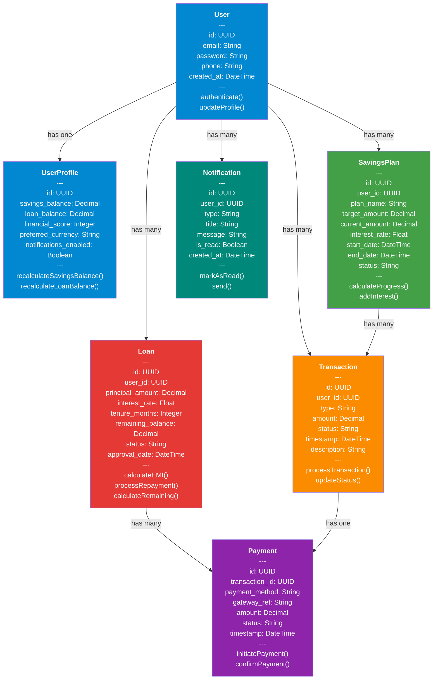

# 🏗️ DIAGRAM 2 OF 9: CLASS DIAGRAM
## Digital Saving Vault (Nzelu Digital Saving)
**Type**: UML Class Diagram | **Shows**: 7 classes with attributes and relationships

## Diagram Code (Mermaid)

## Core Classes:

### 1. **User** (Blue - Authentication)
- **Attributes**: ID, email, password, phone, created_at, updated_at
- **Methods**: authenticate(), updateProfile()
- **Relationships**: Has one UserProfile, many SavingsPlan, Transactions, Loans, Notifications

### 2. **UserProfile** (Blue - Properties)
- **Attributes**: Savings balance, loan balance, financial score, preferred settings
- **Methods**: recalculateSavingsBalance(), recalculateLoanBalance()
- **Relationships**: One-to-One with User

### 3. **SavingsPlan** (Green - Savings)
- **Attributes**: Plan name, target amount, current amount, interest rate, dates, status
- **Methods**: calculateProgress(), addInterest()
- **Relationships**: Many Transactions, belongs to User

### 4. **Transaction** (Orange - Activity)
- **Attributes**: Type, amount, status, timestamp, description
- **Methods**: processTransaction(), updateStatus()
- **Relationships**: Has one Payment, belongs to User and SavingsPlan

### 5. **Loan** (Red - Credit)
- **Attributes**: Principal, interest rate, tenure, remaining balance, status
- **Methods**: calculateEMI(), processRepayment(), calculateRemaining()
- **Relationships**: Many Payments/Repayments, belongs to User

### 6. **Payment** (Purple - Processing)
- **Attributes**: Payment method, gateway reference, amount, status, timestamp
- **Methods**: initiatePayment(), confirmPayment()
- **Relationships**: One Transaction, one Loan

### 7. **Notification** (Teal - Communication)
- **Attributes**: Type, title, message, is_read, created_at
- **Methods**: markAsRead(), send()
- **Relationships**: Belongs to User

## Key Relationships:
- **1:1** - User ↔ UserProfile
- **1:M** - User ↔ SavingsPlan, Transaction, Loan, Notification
- **1:M** - SavingsPlan ↔ Transaction
- **1:M** - Loan ↔ Payment

---
**Document Version**: 1.0  
**Date**: April 2026  
**Project**: Digital Saving Vault (Nzelu Digital Saving)
