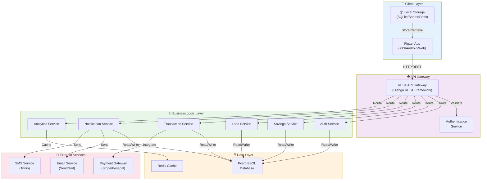

# 🏢 DIAGRAM 3 OF 9: SYSTEM ARCHITECTURE DIAGRAM
## Digital Saving Vault (Nzelu Digital Saving)
**Type**: System Architecture | **Shows**: 5-layer architecture (Client, API, Business Logic, Data, External)

## Diagram Code (Mermaid)

## Architecture Layers:

### 1. **Client Layer** (Light Blue - Frontend)
- **Flutter App**: Cross-platform mobile/web application
  - Android native support
  - iOS native support
  - Web browser support
- **Local Storage**: SQLite + SharedPreferences for offline data persistence

### 2. **API Gateway Layer** (Light Purple - Interface)
- **REST API Gateway**: Django REST Framework endpoints
  - Request routing and validation
  - Load balancing
  - Rate limiting
- **Authentication Service**: JWT token validation and user session management

### 3. **Business Logic Layer** (Light Green - Core Services)
- **Auth Service**: User authentication and authorization
- **Savings Service**: Savings plan management and tracking
- **Loan Service**: Credit application and repayment processing
- **Transaction Service**: Financial transactions handling
- **Notification Service**: Multi-channel notifications (Email, SMS, Push)
- **Analytics Service**: Data analysis and reporting

### 4. **Data Layer** (Light Orange - Storage)
- **PostgreSQL Database**: Main relational database for production
- **Redis Cache**: In-memory caching for performance optimization

### 5. **External Services Layer** (Light Pink - Integrations)
- **Payment Gateway**: Stripe/Pesapal for payment processing
- **Email Service**: SendGrid for email notifications
- **SMS Service**: Twilio for SMS notifications

## Data Flow:
1. User interacts with Flutter app
2. App caches data locally for offline access
3. App sends HTTP/REST requests to API Gateway
4. Gateway validates requests and routes to appropriate service
5. Services process business logic and access database
6. Analytics service uses Redis cache
7. External services send notifications/process payments
8. Results returned to app for UI display

## Key Technical Decisions:
- **REST API** for stateless communication
- **JWT Tokens** for secure authentication
- **PostgreSQL** for ACID compliance
- **Redis Cache** for performance
- **Multi-channel Notifications** for user engagement
- **Third-party Payment Gateway** for secure transactions

---
**Document Version**: 1.0  
**Date**: April 2026  
**Project**: Digital Saving Vault (Nzelu Digital Saving)
