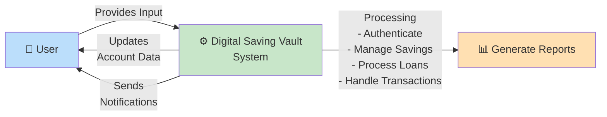

# 📊 DIAGRAM 4 OF 9: DATA FLOW DIAGRAM - LEVEL 1
## Context Diagram - Digital Saving Vault (Nzelu Digital Saving)
**Type**: DFD Level 1 (Context) | **Shows**: High-level system overview

## Diagram Code (Mermaid)

## Level 1 Overview (Context Diagram):

### Entities:

#### 1. **End User** (Blue)
- External entity that interacts with the system
- Can be savers, borrowers, or administrators
- Provides input to the system

#### 2. **Digital Saving Vault System** (Green)
- Core system processing all financial operations
- Main processes:
  - **Authentication**: Verify user identity and credentials
  - **Manage Savings**: Deposit tracking, savings plans, interest calculations
  - **Process Loans**: Credit applications, approvals, repayment scheduling
  - **Handle Transactions**: All financial movements

#### 3. **Report Generation** (Orange)
- Output entity for system reporting
- Generates financial statements and analytics

### Data Flows:

#### **Input Flow: User → System**
- User credentials for authentication
- Deposit and withdrawal requests
- Loan applications
- Transaction requests
- Settings and preferences

#### **Processing by System**
- Validates all transactions
- Calculates interest and fees
- Processes credit applications
- Maintains account balances
- Generates audit logs

#### **Output Flows: System → User**
- Updated account information
- Transaction confirmations
- Account statements
- Authentication responses

#### **Output Flows: System → Reports**
- Financial summaries
- User activity reports
- Transaction history
- Statistical analysis

## Key System Functions:
1. Secure user authentication and session management
2. Real-time balance tracking and updates
3. Transaction processing and verification
4. Interest calculation and reward distribution
5. Loan management and repayment tracking
6. Comprehensive reporting and analytics
7. Multi-channel notification delivery

## System Boundaries:
- **Inside**: Core application logic, database, business rules
- **Outside**: Users, payment gateways, email/SMS services, reporting tools

---
**Document Version**: 1.0  
**Date**: April 2026  
**Project**: Digital Saving Vault (Nzelu Digital Saving)  
**Diagram Type**: Context Diagram / DFD Level 1
