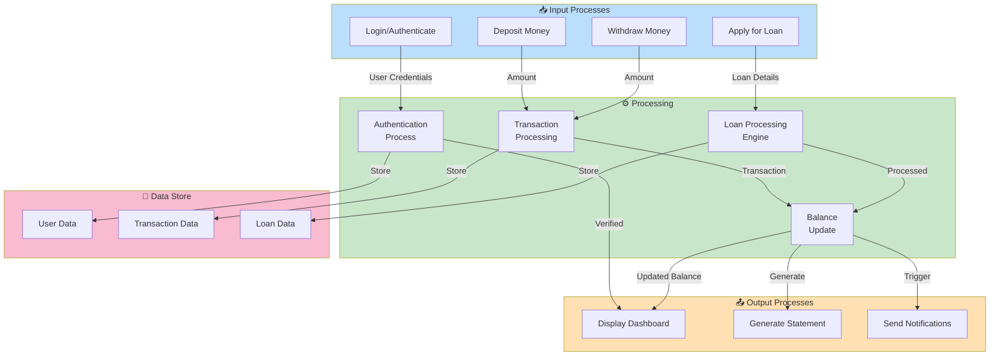

# 📊 DIAGRAM 5 OF 9: DATA FLOW DIAGRAM - LEVEL 2
## Component View - Digital Saving Vault (Nzelu Digital Saving)
**Type**: DFD Level 2 (Components) | **Shows**: 4 main processes, 3 data stores

## Diagram Code (Mermaid)

## Level 2 Expansion:

### INPUT PROCESSES (Blue):
1. **Login/Authenticate**: User login with email and password
2. **Deposit Money**: User initiates deposit transaction
3. **Withdraw Money**: User requests funds withdrawal
4. **Apply for Loan**: User submits credit application

### PROCESSING MODULES (Green):
1. **Authentication Process**
   - Validates user credentials against database
   - Generates/refreshes authentication tokens
   - Manages user sessions
   - Outputs: Verified user or error

2. **Transaction Processing**
   - Validates deposit/withdrawal requests
   - Checks account limits and rules
   - Processes the transaction
   - Updates transaction records

3. **Loan Processing Engine**
   - Evaluates credit applications
   - Calculates EMI and repayment schedules
   - Determines approval/rejection
   - Manages loan lifecycle

4. **Balance Update Process**
   - Aggregates all transactions
   - Calculates current balance
   - Applies interest and fees
   - Updates user profile

### OUTPUT PROCESSES (Orange):
1. **Display Dashboard**: Shows user's current financial status
2. **Generate Statement**: Creates transaction history and reports
3. **Send Notifications**: Dispatches alerts via email/SMS/push

### DATA STORES (Pink):
1. **User Data**: User profiles, authentication, settings
2. **Transaction Data**: Deposits, withdrawals, transfers, complete history
3. **Loan Data**: Loan applications, approvals, repayments, schedules

## Data Flow Sequences:

### Deposit Flow:
User → Deposit Input → Transaction Processing → Balance Update → Dashboard/Statement/Notification

### Login Flow:
User → Login Input → Authentication Process → Dashboard (if successful)

### Withdrawal Flow:
User → Withdraw Input → Transaction Processing → Balance Update → Notification

### Loan Application Flow:
User → Apply Loan Input → Loan Processing → Notification → Dashboard

---
**Document Version**: 1.0  
**Date**: April 2026  
**Project**: Digital Saving Vault (Nzelu Digital Saving)  
**Diagram Type**: DFD Level 2
