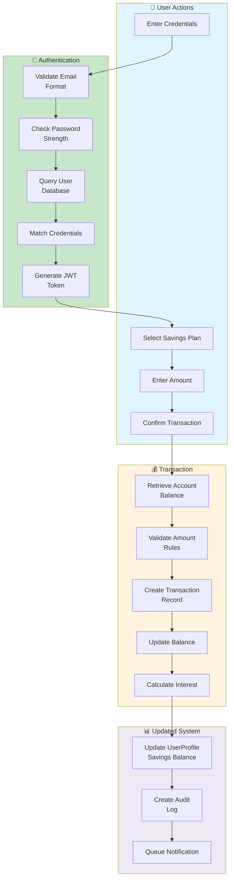

# 📊 DIAGRAM 6 OF 9: DATA FLOW DIAGRAM - LEVEL 3
## Detailed Process Flow - Digital Saving Vault (Nzelu Digital Saving)
**Type**: DFD Level 3 (Detailed) | **Shows**: 20+ individual steps with validation rules

## Diagram Code (Mermaid)

## Level 3 - Detailed Step-by-Step Process:

### PHASE A: User Actions (Light Blue)
**Step 1**: User enters credentials (email/phone + password)
**Step 2**: User selects savings plan (Flex, Fixed, Goal-based)
**Step 3**: User enters transaction amount
**Step 4**: User confirms transaction with 2FA if enabled

### PHASE B: Authentication Process (Green)
**Step B1**: Validate Email Format
- Check valid email structure
- Verify email not blocked
- Return: Valid/Invalid email

**Step B2**: Check Password Strength
- Minimum 8 characters
- Mix of uppercase, lowercase, numbers
- No common patterns
- Return: Pass/Fail

**Step B3**: Query User Database
- Look up user record
- Check account status (active/suspended)
- Retrieve stored password hash
- Return: User record or "Not Found"

**Step B4**: Match Credentials
- Compare entered password with stored hash (bcrypt)
- Verify account hasn't been locked
- Check login attempts
- Return: Match/No Match

**Step B5**: Generate JWT Token
- Create JWT with user ID and expiry
- Sign with secret key
- Return: Token + Refresh Token

### PHASE C: Transaction Processing (Orange)
**Step C1**: Retrieve Account Balance
- Query user's current balance
- Include pending transactions
- Check hold amounts
- Return: Available balance

**Step C2**: Validate Amount Rules
- Check minimum deposit amount (e.g., $5)
- Check maximum per transaction
- Check daily limit not exceeded
- Validate against savings plan rules
- Return: Valid/Invalid

**Step C3**: Create Transaction Record
- Generate transaction ID (UUID)
- Record type (DEPOSIT/WITHDRAWAL)
- Amount, timestamp, plan reference
- Set status to PENDING
- Return: Transaction created

**Step C4**: Update Balance
- Deduct/Add amount to account
- Update last transaction date
- Lock account during processing
- Return: New balance

**Step C5**: Calculate Interest
- Determine applicable interest rate
- Calculate based on amount and term
- Record interest earned/charged
- Return: Interest amount

### PHASE D: Update System (Light Purple)
**Step D1**: Update UserProfile Savings Balance
- Update savings_balance in UserProfile
- Update financial_score based on activity
- Recalculate statistics
- Return: Profile updated

**Step D2**: Create Audit Log
- Log transaction details
- Record user IP address
- Log timestamp and action
- Store for compliance
- Return: Log entry created

**Step D3**: Queue Notification
- Add notification to queue
- Include transaction details
- Set delivery channels (Email/SMS/Push)
- Return: Notification queued

## Key Validation Rules:
1. **Email Format**: Must match RFC 5322 standards
2. **Password**: Min 8 chars, mixed case, numbers, no common words
3. **Amount**: Min: $5, Max: $50,000 (configurable)
4. **Daily Limit**: Max $100,000 per day
5. **Transaction Time**: Within banking hours (or 24/7 for online)
6. **Account Status**: Must be ACTIVE or VERIFIED

## Error Handling:
- **B1 Fail**: Return "Invalid email format"
- **B2 Fail**: Return "Password doesn't meet requirements"
- **B3 Fail**: Return "User not found"
- **B4 Fail**: Return "Incorrect credentials" (after 3 attempts, lock account)
- **C2 Fail**: Return "Amount exceeds limits"
- **C3 Fail**: Return "Transaction processing failed"

## Response Times (SLA):
- Authentication: < 500ms
- Transaction Processing: < 2 seconds
- Notification Queue: Immediate
- Notification Delivery: < 5 minutes

---
**Document Version**: 1.0  
**Date**: April 2026  
**Project**: Digital Saving Vault (Nzelu Digital Saving)  
**Diagram Type**: DFD Level 3 (Detailed Process Flow)
