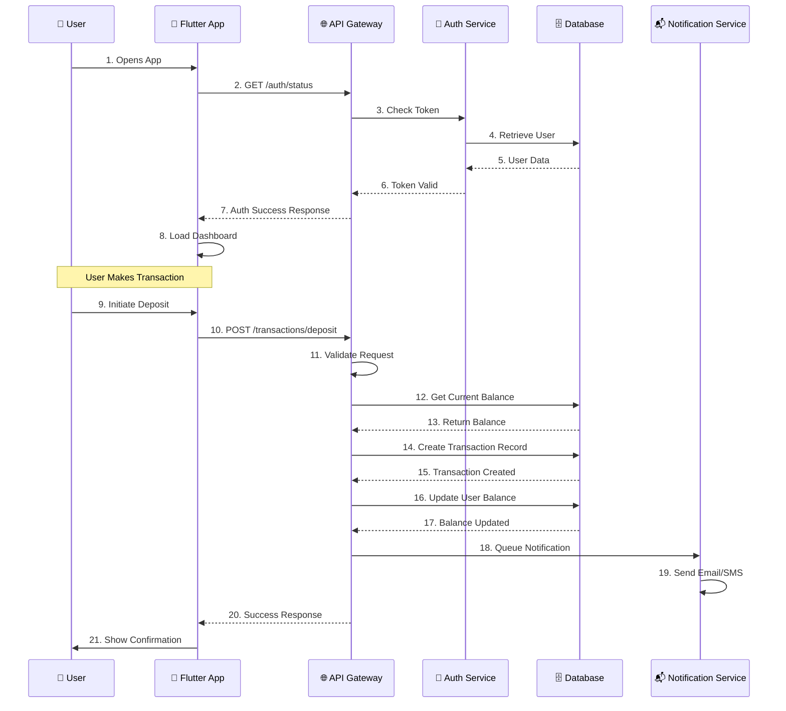

# ⏱️ DIAGRAM 8 OF 9: SEQUENTIAL DIAGRAM
## Digital Saving Vault (Nzelu Digital Saving)
**Type**: UML Sequence Diagram | **Shows**: 21-step interactions (login + transaction flow)

## Diagram Code (Mermaid)



## Sequence Breakdown:

### PART 1: APP INITIALIZATION (Steps 1-8)

**Step 1**: User Opens App
- User taps application icon
- App launches and initializes

**Step 2**: Flutter App → API Gateway
- App sends GET request to `/auth/status` endpoint
- Includes stored JWT token (if available)
- Headers: Authorization: Bearer {token}

**Step 3**: API Gateway → Auth Service
- Gateway forwards request to authentication service
- Passes token for validation
- Includes: request ID, timestamp, device info

**Step 4**: Auth Service → Database
- Auth service queries user record
- Validates token against stored data
- Checks token expiration

**Step 5**: Database → Auth Service
- Returns user record and token metadata
- Includes: user_id, email, account_status, last_login
- Status: SUCCESS or EXPIRED

**Step 6**: Auth Service → API Gateway
- Confirms token validity
- Returns: user profile, permissions, settings
- Status code: 200 OK

**Step 7**: API Gateway → Flutter App
- Sends formatted response with user data
- Status: Authenticated/Not Authenticated
- Includes: user balance, preferences, settings

**Step 8**: Flutter App Internal
- App processes authentication response
- Initializes state providers
- Loads cached data
- Renders dashboard UI

### PART 2: USER TRANSACTION (Steps 9-21)

**Step 9**: User → Flutter App
- User initiates deposit action
- Enters amount: 5000 MWK
- Selects savings plan: "Emergency Fund"
- Clicks "Confirm Deposit"

**Step 10**: Flutter App → API Gateway
- Sends POST request to `/transactions/deposit`
- Request body:
  ```json
  {
    "amount": 5000,
    "plan_id": "plan_123",
    "description": "Regular deposit",
    "payment_method": "bank_transfer"
  }
  ```
- Headers: Include JWT token for authentication

**Step 11**: API Gateway Processing
- Validates request format (JSON schema)
- Checks content-type headers
- Verifies request signature
- Rate limiting check
- Result: Request valid → proceed

**Step 12**: API Gateway → Database
- Queries current user account
- Retrieves:
  - savings_balance: 45000
  - account_status: ACTIVE
  - daily_deposit_limit: 100000
  - today_deposited: 20000

**Step 13**: Database → API Gateway
- Returns:
  - Current balance: 45000 MWK
  - Available limit today: 80000 MWK
  - Account status: ACTIVE

**Step 14**: API Gateway → Database
- Creates new transaction record:
  ```json
  {
    "id": "tx_987654",
    "user_id": "user_123",
    "type": "DEPOSIT",
    "amount": 5000,
    "status": "PENDING",
    "plan_id": "plan_123",
    "timestamp": "2024-04-15 14:30:00",
    "created_at": "2024-04-15 14:30:00"
  }
  ```

**Step 15**: Database → API Gateway
- Confirms transaction record created
- Returns: Transaction ID, reference number
- Status: Record persisted

**Step 16**: API Gateway → Database
- Updates user balance:
  - FROM: 45000 MWK
  - TO: 50000 MWK (45000 + 5000)
- Executes atomic SQL transaction
- Locks account briefly to prevent race conditions

**Step 17**: Database → API Gateway
- Confirms balance updated
- Returns: New balance (50000 MWK)
- Transaction committed

**Step 18**: API Gateway → Notification Service
- Queues notification message:
  ```json
  {
    "user_id": "user_123",
    "type": "TRANSACTION_SUCCESS",
    "title": "Deposit Successful",
    "message": "5000 MWK deposited to Emergency Fund",
    "channels": ["email", "sms", "push"],
    "priority": "HIGH"
  }
  ```

**Step 19**: Notification Service Internal
- Sends email via SendGrid
- Sends SMS via Twilio
- Sends push notification
- Logs notification delivery status

**Step 20**: API Gateway → Flutter App
- Returns success response:
  ```json
  {
    "status": "success",
    "transaction_id": "tx_987654",
    "message": "Deposit processed successfully",
    "new_balance": 50000,
    "currency": "MWK",
    "timestamp": "2024-04-15 14:30:15"
  }
  ```
- Status code: 200 OK

**Step 21**: Flutter App → User
- Displays success dialog
- Shows:
  - "Deposit Successful!"
  - Transaction ID: tx_987654
  - Amount: 5000 MWK
  - New Balance: 50000 MWK
  - "Close" button → returns to dashboard
- Updates UI to reflect new balance
- Stores transaction in local cache

## Important Aspects:

### Security:
- All API calls include JWT token authentication
- HTTPS encryption for all requests
- Request signing to prevent tampering
- Rate limiting to prevent abuse

### Error Handling:
- Network errors: Show "Connection failed" + retry
- Invalid token: Prompt re-login
- Insufficient balance: Show error message
- Server errors: Cascade with exponential backoff

### Performance:
- API → DB: < 100ms
- DB transaction: < 50ms
- Notification queue: < 200ms
- Total end-to-end: < 2 seconds

### Data Consistency:
- All financial transactions in atomic database transactions
- No partial updates allowed
- Audit logs maintained for compliance
- Transaction rollback on any failure

## Alternative Scenarios:

### Scenario A: Network Failure
- App unable to reach Gateway
- Show: "Network unavailable, retry?"
- Retry logic with exponential backoff
- Store transaction locally for sync when online

### Scenario B: Insufficient Balance
- Step 13: Balance check fails (balance < 5000)
- Skip steps 14-19
- Return error: "Insufficient balance"
- Display available balance to user

### Scenario C: Daily Limit Exceeded
- Step 13: today_deposited (20000) + amount (5000) > limit (100000)
- Transaction rejected
- Return: "Daily deposit limit exceeded"

---
**Document Version**: 1.0  
**Date**: April 2026  
**Project**: Digital Saving Vault (Nzelu Digital Saving)  
**Diagram Type**: Sequence Diagram
