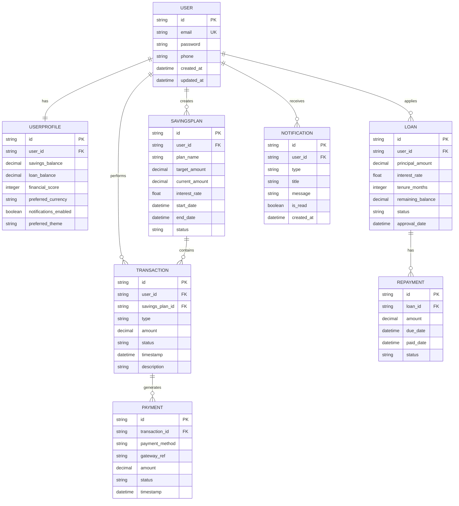

# 🗄️ DIAGRAM 9 OF 9: ENTITY RELATIONSHIP DIAGRAM (ERD)
## Database Schema - Digital Saving Vault (Nzelu Digital Saving)
**Type**: Entity Relationship Diagram | **Shows**: 8 database tables with relationships and indexes

## Diagram Code (Mermaid)

## Entity Descriptions:

### 1. **USER** (Primary Entity)
**Purpose**: Core user account and authentication

**Attributes**:
- `id` (PK): Unique user identifier (UUID)
- `email` (UK): Unique email address
- `password`: Hashed password (bcrypt)
- `phone`: Contact phone number
- `created_at`: Account creation timestamp
- `updated_at`: Last update timestamp

**Constraints**:
- Email must be unique and valid format
- Password must be hashed (never stored plain)
- Phone optional but unique if provided

---

### 2. **USERPROFILE** (1:1 with USER)
**Purpose**: Extended user information and balances

**Attributes**:
- `id` (PK): Profile ID
- `user_id` (FK): Reference to USER
- `savings_balance` (Decimal): Total savings amount
- `loan_balance` (Decimal): Outstanding loan amount
- `financial_score` (Integer): 0-100, calculated monthly
- `preferred_currency` (String): Default currency (e.g., MWK, USD)
- `notifications_enabled` (Boolean): Global notification toggle
- `preferred_theme` (String): Light/Dark/System

**Constraints**:
- One profile per user (1:1)
- Balances >= 0
- Financial score between 0-100

---

### 3. **SAVINGSPLAN** (1:M with USER)
**Purpose**: User's individual savings goals and plans

**Attributes**:
- `id` (PK): Plan ID
- `user_id` (FK): Owner of the plan
- `plan_name` (String): Custom or preset (Emergency Fund, Education, etc.)
- `target_amount` (Decimal): Savings goal amount
- `current_amount` (Decimal): Amount saved so far
- `interest_rate` (Float): Annual interest rate %
- `start_date` (DateTime): When plan started
- `end_date` (DateTime): Target completion date
- `status` (String): ACTIVE, COMPLETED, PAUSED, CANCELLED

**Constraints**:
- target_amount > 0
- current_amount <= target_amount
- end_date > start_date
- interest_rate >= 0

---

### 4. **TRANSACTION** (1:M with USER & SAVINGSPLAN)
**Purpose**: Record all financial transactions

**Attributes**:
- `id` (PK): Transaction ID
- `user_id` (FK): User performing transaction
- `savings_plan_id` (FK): Associated plan (optional)
- `type` (String): DEPOSIT, WITHDRAWAL, INTEREST_REWARD, PENALTY, TRANSFER
- `amount` (Decimal): Transaction amount
- `status` (String): PENDING, COMPLETED, FAILED, REVERSED
- `timestamp` (DateTime): When transaction occurred
- `description` (String): Transaction notes

**Constraints**:
- amount > 0
- type must be valid enum
- timestamp should not be in future
- One transaction per record

---

### 5. **LOAN** (1:M with USER)
**Purpose**: Credit/loan applications and management

**Attributes**:
- `id` (PK): Loan ID
- `user_id` (FK): Borrower
- `principal_amount` (Decimal): Original loan amount
- `interest_rate` (Float): Annual interest rate %
- `tenure_months` (Integer): Loan duration in months
- `remaining_balance` (Decimal): Amount still owed
- `status` (String): PENDING, APPROVED, ACTIVE, COMPLETED, DEFAULTED
- `approval_date` (DateTime): When loan was approved

**Constraints**:
- principal_amount > 0
- tenure_months > 0
- interest_rate >= 0
- remaining_balance <= principal_amount
- approval_date not in future

---

### 6. **REPAYMENT** (1:M with LOAN)
**Purpose**: Track individual loan repayment installments

**Attributes**:
- `id` (PK): Repayment ID
- `loan_id` (FK): Associated loan
- `amount` (Decimal): Installment amount
- `due_date` (DateTime): When payment is due
- `paid_date` (DateTime): When payment was made (null if unpaid)
- `status` (String): PENDING, PAID, OVERDUE, WAIVED

**Constraints**:
- amount > 0
- due_date < loan end date
- paid_date >= due_date (if paid)
- One record per installment

---

### 7. **PAYMENT** (1:1 with TRANSACTION, 1:M with LOAN)
**Purpose**: Payment gateway integration and processing records

**Attributes**:
- `id` (PK): Payment ID
- `transaction_id` (FK): Associated transaction
- `payment_method` (String): BANK_TRANSFER, MOBILE_MONEY, CARD, etc.
- `gateway_ref` (String): Payment gateway reference number
- `amount` (Decimal): Amount processed
- `status` (String): PENDING, PROCESSING, COMPLETED, FAILED, REFUNDED
- `timestamp` (DateTime): When payment was processed

**Constraints**:
- amount > 0
- gateway_ref must be valid
- One payment per transaction (typically)

---

### 8. **NOTIFICATION** (1:M with USER)
**Purpose**: Track user communications and notifications

**Attributes**:
- `id` (PK): Notification ID
- `user_id` (FK): Recipient
- `type` (String): TRANSACTION, REWARD, ALERT, PROMO, SYSTEM
- `title` (String): Notification title
- `message` (String): Notification content
- `is_read` (Boolean): Read status
- `created_at` (DateTime): When notification was created

**Constraints**:
- title and message not empty
- created_at not in future
- is_read defaults to false

---

## Relationships Summary:

| Relationship | Type | Cardinality | Description |
|---|---|---|---|
| USER - USERPROFILE | 1:1 | One-to-One | Each user has exactly one profile |
| USER - SAVINGSPLAN | 1:M | One-to-Many | User can have multiple plans |
| USER - TRANSACTION | 1:M | One-to-Many | User performs multiple transactions |
| USER - LOAN | 1:M | One-to-Many | User can have multiple loans |
| USER - NOTIFICATION | 1:M | One-to-Many | User receives multiple notifications |
| SAVINGSPLAN - TRANSACTION | 1:M | One-to-Many | Plan contains multiple transactions |
| LOAN - REPAYMENT | 1:M | One-to-Many | Loan has multiple repayments |
| TRANSACTION - PAYMENT | 1:1 | One-to-One | Transaction linked to one payment |

## Key Design Principles:

1. **Normalization**: 3NF design to eliminate data redundancy
2. **Referential Integrity**: Foreign keys enforce relationships
3. **Audit Trail**: Created_at and updated_at timestamps on all entities
4. **Status Tracking**: String enums for state management
5. **Decimal Precision**: Decimal type for financial data (not float)
6. **Atomic Transactions**: Multi-table updates in single transaction
7. **Data Partitioning**: Ready for horizontal scaling by user_id

## Indexes Recommended:
- USER: email (UNIQUE), created_at
- USERPROFILE: user_id (FK)
- SAVINGSPLAN: user_id (FK), status, created_at
- TRANSACTION: user_id (FK), timestamp, status
- LOAN: user_id (FK), status, approval_date
- REPAYMENT: loan_id (FK), due_date, status
- PAYMENT: transaction_id (FK), created_at
- NOTIFICATION: user_id (FK), is_read, created_at

---
**Document Version**: 1.0  
**Date**: April 2026  
**Project**: Digital Saving Vault (Nzelu Digital Saving)  
**Diagram Type**: Entity Relationship Diagram (Chen's Notation)
